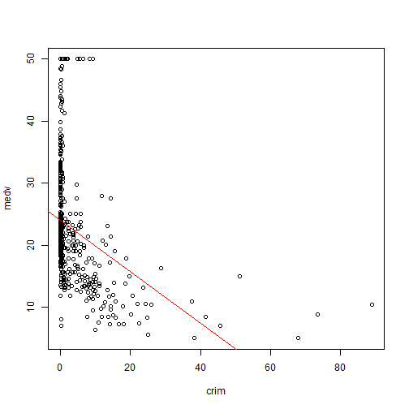

## Project Introduction
The shiny project illustrates linear regression model in an interactive way. Boston data set in MASS library is used in the model.
The response variable in the model is medv: median value of owner-occupied homes in $1000s, and the others are predictor variables.
A summary of data is provided in the Data Summary tab. Both single variable and multi-variable linear regression models are built in the project.
- For single variable linear regression model, user can select any predictor in the left panel. In the Single Variable Linear Regression Model tab, a linear regression model based on the selected predictor is built. Plot of response and predictor variables with regression line is available as well. 
- For multi-variable linear regression model, user can select predictors in the left panel. In the Multi Variable Linear Regression Model tab, linear regression model based on the selected predictors is built

When the predictors are changed, the regression model will be updated real time.

---

## Illustration - Single Variable Regression Model
This is an illustration of the single variable linear regression model output. Assume user chooses 'crim' as the predictor, in the main panel, the following model will be shown

```
## 
## Call:
## lm(formula = medv ~ crim, data = Boston)
## 
## Residuals:
##    Min     1Q Median     3Q    Max 
## -16.96  -5.45  -2.01   2.51  29.80 
## 
## Coefficients:
##             Estimate Std. Error t value Pr(>|t|)    
## (Intercept)  24.0331     0.4091   58.74   <2e-16 ***
## crim         -0.4152     0.0439   -9.46   <2e-16 ***
## ---
## Signif. codes:  0 '***' 0.001 '**' 0.01 '*' 0.05 '.' 0.1 ' ' 1
## 
## Residual standard error: 8.48 on 504 degrees of freedom
## Multiple R-squared:  0.151,	Adjusted R-squared:  0.149 
## F-statistic: 89.5 on 1 and 504 DF,  p-value: <2e-16
```

---

## Illustration - Single Variable Regression Model (con't)
A plot of response and predictor variables with regression line is provided below the model summary

 

---
## Illustration - Multi Variable Regression Model
This is an illustration of the multi-variable linear regression model output. Assume user selects 'crim', 'zn', 'indus' as predictors, in the main panel, the following model will be shown


```
## 
## Call:
## lm(formula = medv ~ crim + zn + indus, data = Boston)
## 
## Residuals:
##    Min     1Q Median     3Q    Max 
## -13.07  -4.73  -1.59   2.65  32.42 
## 
## Coefficients:
##             Estimate Std. Error t value Pr(>|t|)    
## (Intercept)  27.3946     0.8648   31.68  < 2e-16 ***
## crim         -0.2486     0.0439   -5.66  2.5e-08 ***
## zn            0.0585     0.0175    3.34  0.00089 ***
## indus        -0.4156     0.0638   -6.52  1.8e-10 ***
## ---
## Signif. codes:  0 '***' 0.001 '**' 0.01 '*' 0.05 '.' 0.1 ' ' 1
## 
## Residual standard error: 7.75 on 502 degrees of freedom
## Multiple R-squared:  0.294,	Adjusted R-squared:  0.289 
## F-statistic: 69.6 on 3 and 502 DF,  p-value: <2e-16
```
